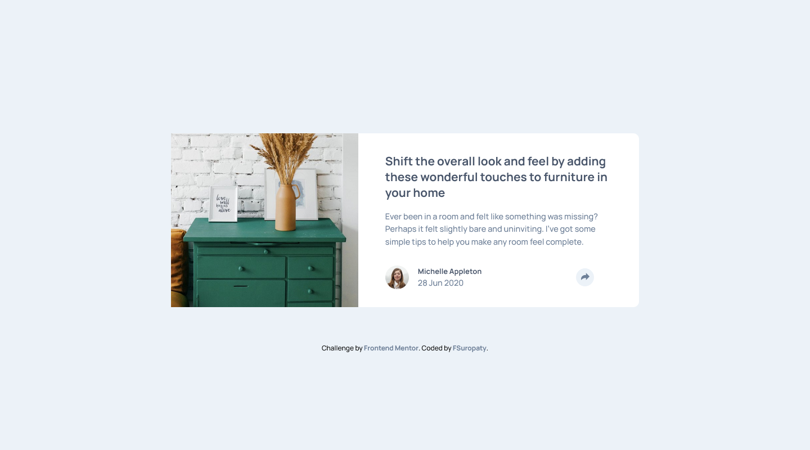
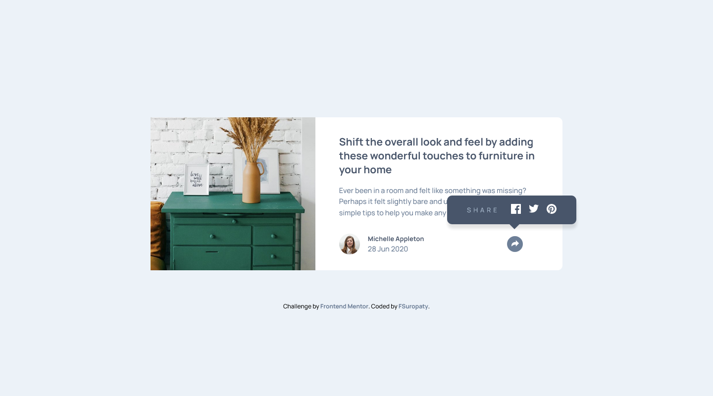
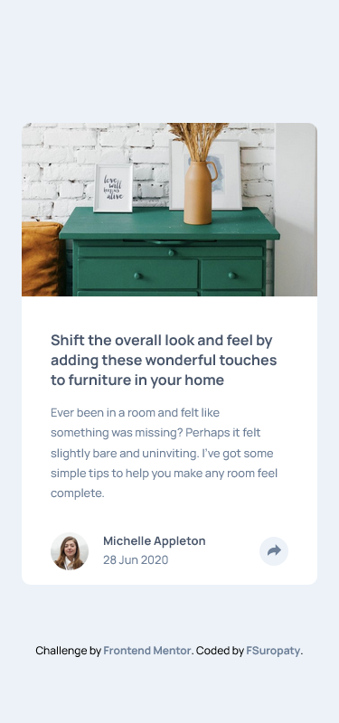
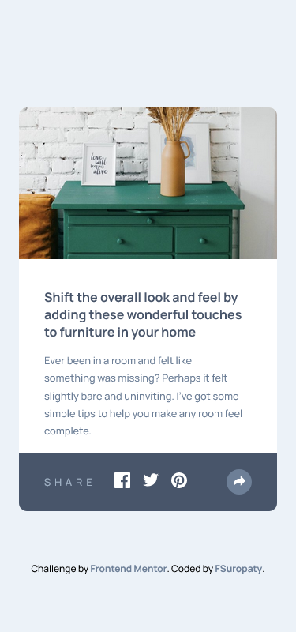

# Frontend Mentor - Article preview component solution

This is a solution to the [Article preview component challenge on Frontend Mentor](https://www.frontendmentor.io/challenges/article-preview-component-dYBN_pYFT). Frontend Mentor challenges help you improve your coding skills by building realistic projects.

## Table of contents

- [Frontend Mentor - Article preview component solution](#frontend-mentor---article-preview-component-solution)
  - [Table of contents](#table-of-contents)
  - [Overview](#overview)
    - [The challenge](#the-challenge)
    - [Screenshot](#screenshot)
    - [Links](#links)
  - [My process](#my-process)
    - [Built with](#built-with)
    - [What I learned](#what-i-learned)
    - [Useful resources](#useful-resources)
  - [Author](#author)
  - [Acknowledgments](#acknowledgments)

**Note: Delete this note and update the table of contents based on what sections you keep.**

## Overview

### The challenge

Users should be able to:

- View the optimal layout for the component depending on their device's screen size
- See the social media share links when they click the share icon

### Screenshot






### Links

- Solution URL: [Frontendmentor.io](https://your-solution-url.com)
- Live Site URL: [fsuropaty.github.io](https://your-live-site-url.com)

## My process

### Built with

- Semantic HTML5 markup
- SASS/SCSS
- Flexbox
- CSS Grid
- Mobile-first workflow
-

### What I learned

I learned about :

- SASS/SCSS
- JS
- Accessibilty

```css
/* Pointy pop up thingy */
&::after {
  content: "";
  position: absolute;
  top: 100%;
  left: 50%;
  margin-left: -5px;
  border-width: 10px;
  border-style: solid;
  border-color: $Very-Dark-Grayish-Blue transparent transparent transparent;
}
```

```js
function sharePopup() {
  btn.classList.toggle("active");
  popup.classList.toggle("pop-up-active");
}
```

### Useful resources

- [W3Schools](https://www.w3schools.com) - Pretty much your guidebook in website development
- [MDN](https://developer.mozilla.org) - W3Schools but from Mozilla.
- [Layoutit!](https://grid.layoutit.com) - A very cool grid generator
- [CSS Tricks](https://css-tricks.com) - A ton of CSS Tricks
- [Kevin Powell](https://www.youtube.com/@KevinPowell) - Make you love CSS more

## Author

- Website - [fsuropaty]()
- Frontend Mentor - [@fsuropaty](https://www.frontendmentor.io/profile/fsuropaty)

## Acknowledgments

One of [Kevin Powell's](https://www.youtube.com/@KevinPowell) newest video is about accesibility and it gives me so much knowledge about accesibility in web development, you should definitely check him out.
